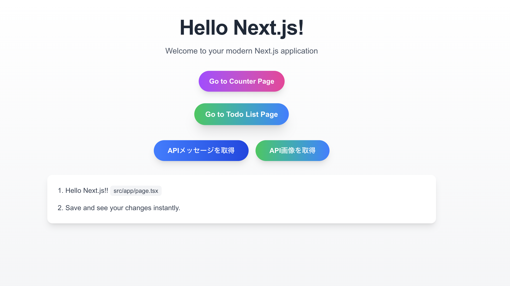
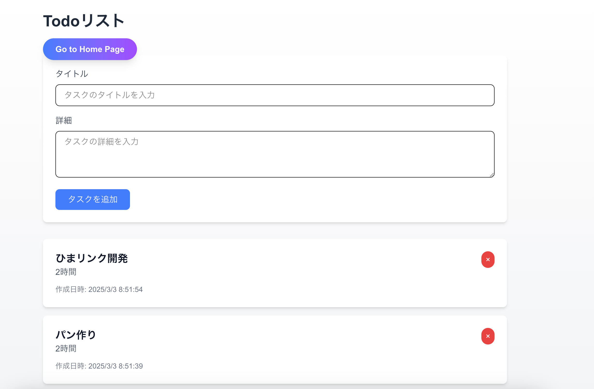
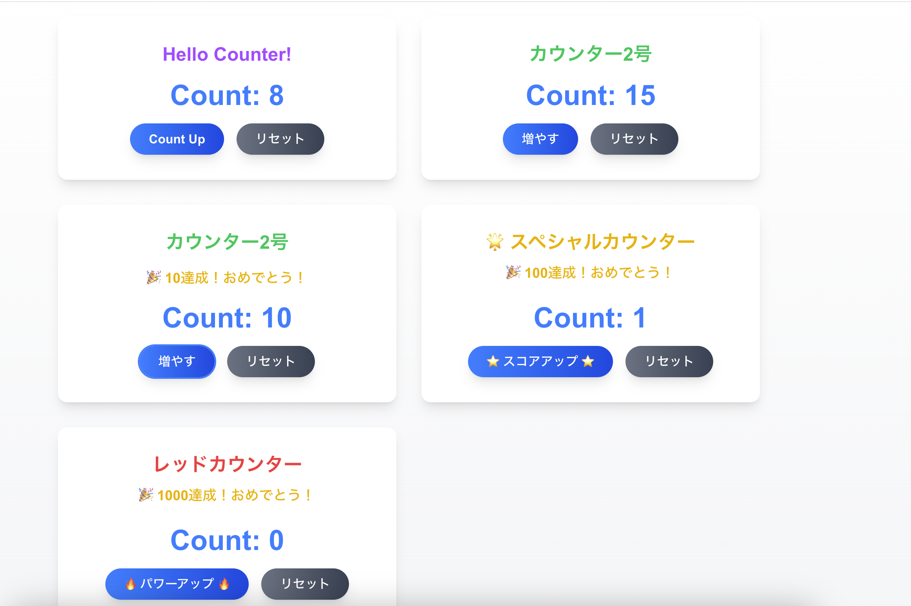

# my-first-next-app

## プロジェクト概要
- **フレームワーク**: Next.js を使用した React アプリケーション
- **データベース**: Supabase を利用してデータの管理を実施

## 主な機能

### 1. トップページ
- アプリケーションのホーム画面を表示
- APIからメッセージと画像を取得し表示する機能
- カウンターページと Todo リストページへのナビゲーションリンクを提供



### 2. Todoリストページ
- タスクの一覧表示
- 新規タスクの追加
- 既存タスクの編集
- タスクの削除（削除時に確認メッセージを表示）
- タスクのタイトルや詳細をクリックして編集モードに切り替え



### 3. カウンターページ
- 複数のカウンターを表示し、各カウンターの値を増減可能
- カウンターの状態をローカルストレージに保存し、ページリロード後も状態を復元



## 技術的仕様
- **Supabase**: データベースとして利用し、CRUD操作を実施
- **環境変数**:  
  - `NEXT_PUBLIC_SUPABASE_URL`  
  - `NEXT_PUBLIC_SUPABASE_ANON_KEY`  
  上記の環境変数を使用してSupabaseに接続
- **スタイリング**: Tailwind CSS を使用して、レスポンシブかつ美しいデザインを実現

## ユーザーインターフェース
- **ナビゲーション**: トップページからカウンターやTodoリストページへのリンクを提供
- **ボタン**: APIからメッセージや画像を取得するためのボタンにホバーアニメーションを追加し、ユーザーインタラクションを向上
- **エラーハンドリング**: 各操作でエラーが発生した場合、コンソールにエラーメッセージを表示（必要に応じてアラート等でユーザーに通知）

## 開発環境

### 必要な前提条件
- **Node.js**: v16.x 以上（推奨）
- **npm**: v8.x 以上  
  ※Yarn や pnpm を利用する場合は、適宜コマンドを置き換えてください

### セットアップ手順
1. **リポジトリのクローン**
   ```bash
   git clone https://github.com/your-username/my-first-next-app.git
   cd my-first-next-app
   ```

2. **依存関係のインストール**
   ```bash
   npm install
   ```

3. **環境変数の設定**
   プロジェクトルートに `.env.local` ファイルを作成し、以下の内容を記述してください。
   ```
   NEXT_PUBLIC_SUPABASE_URL=https://your-supabase-project.supabase.co
   NEXT_PUBLIC_SUPABASE_ANON_KEY=your-anon-key
   ```

4. **ローカル開発サーバーの起動**
   ```bash
   npm run dev
   ```

   ブラウザで [http://localhost:3000] にアクセスし、アプリが正しく動作するか確認してください。

## 補足情報
- **バージョン管理**: GitHub を使用してコードのバージョン管理と共有を行っています。
- **API仕様**:
  - `/api/hello` エンドポイントは、POSTメソッドでメッセージとスタイル情報、GETメソッドで画像を取得します。
